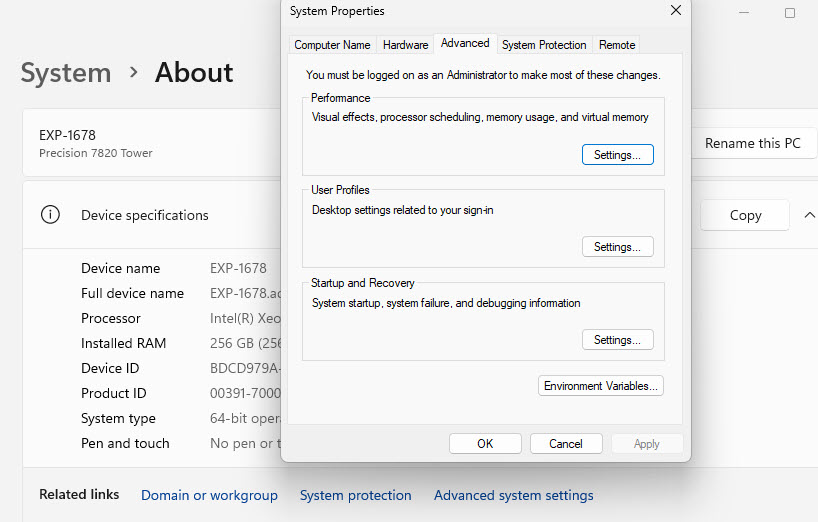
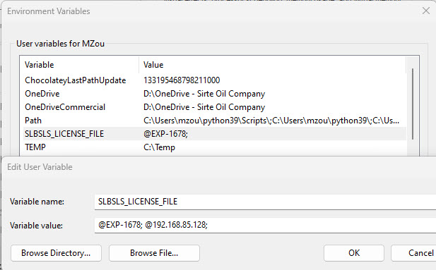

# Reset Environment Variables in Windows

by Marcus Zou | 8 Feb 2023

## 1. Scenario

A request was in place to switch the Environments in Windows 10/11 such that to accommodate different business needs.

In Windows 10/11, go to "**Settings**" --> "**About**" --> "**Advanced system settings**" (Figure 1),



Click button of "**Environment Variables**" button to open up "`Environment variables`" window, then double-click the variable of "`SLBSLS_LICENSE_FILE`", we shall have observed 2 Variable values:
* @EXP-1678;
* @192.168.85.128;
  



The business need is to switch the value items of the `Variable value` to address different license package for different business cases.

How could we do?

## 2. Solutions

There is a **SETX** command to set the environment variables in the format of `SETX <env_variable_name> <env_variable_value`:

```shell
## Set to the local
SETX SLBSLS_LICENSE_FILE "@EXP-1678;"
```

In order to make this change in effect without restarting the computer, we need the help of a **Chocolatey** command: `refreshenv`. So we need to install Chocolatey.


Here are the steps:

First, ensure that we are using an Administrative shell of `PowerShell`:

```
Get-ExecutionPolicy
```

If it returns `Restricted`, then run `Set-ExecutionPolicy AllSigned` or `Set-ExecutionPolicy Bypass -Scope Process`.

Now run the following `PowerShell` command to set the execution policy and install `Chocolatey`:

```
Set-ExecutionPolicy Bypass -Scope Process -Force; [System.Net.ServicePointManager]::SecurityProtocol = [System.Net.ServicePointManager]::SecurityProtocol -bor 3072; iex ((New-Object System.Net.WebClient).DownloadString('https://community.chocolatey.org/install.ps1'))
```

then we could create another 2 command batch files to set the environment variables, the `set_to_local.bat` file could bear:

```
SETX SLBSLS_LICENSE_FILE "@EXP-1678;"
refreshenv
```

the `set_to_remote.bat` file could bear:

```
SETX SLBSLS_LICENSE_FILE "@192.168.85.128;"
refreshenv
```

Hola, we are all set.

## 3. Files

The following 2 files are one-time job runner:

```
1_Get-ExecutionPolicy.ps1
2_Install_Chocolatey.ps1
```

And the following 2 files are for daily operations:

```
set_to_local.bat
set_to_remote.bat
```


## 4. License

MIT
